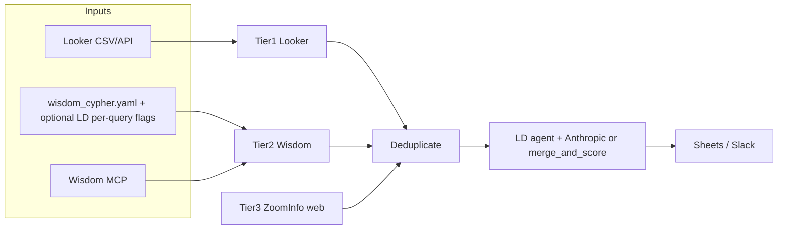

# figment-agent

Python pipeline that builds the **E100 expansion account list**: Tier 1 usage data from Looker, Tier 2 competitive intelligence from [Enterpret Wisdom](https://helpcenter.enterpret.com/en/articles/12665166-wisdom-mcp-server) (MCP), optional Tier 3 web signals, merge/dedupe, then **rank** with an optional **LaunchDarkly agent AI Config + Anthropic** prioritizer (default) or **deterministic** `merge_and_score` / `core/scorer.py` as fallback. See **E100 prioritizer** below.

## What it does

1. **Tier 1 — Looker** — Loads accounts from a CSV export (`LOOKER_EXPORT_PATH`) or, when configured, from the Looker API.
2. **Tier 2 — Enterpret Wisdom** — If `WISDOM_AUTH_TOKEN` is set, runs **`execute_cypher_query` only** (no prose / `search_knowledge_graph`). Cypher comes from [`config/wisdom_cypher.yaml`](config/wisdom_cypher.yaml) merged with optional **per-query** LaunchDarkly JSON flags, or from `WISDOM_CYPHER_*` / `WISDOM_CYPHER` env vars. **Cypher is required** for every Tier-2 job or the run fails fast.
3. **Tier 3** — Optional allowlisted web fetch (`TIER3_WEB_ENABLED=1`, [`config/tier3_sources.yaml`](config/tier3_sources.yaml)): keyword/competitor hits in page text → `AccountRecord` (`tier=3`). Crawl depth / JS rendering are future work.
4. **Merge** — Deduplicates by account name and merges tier signals.
5. **Rank** — By default (`E100_PRIORITIZER_MODE=llm`), evaluates the LaunchDarkly **agent** AI Config (`E100_PRIORITIZER_AI_CONFIG_KEY`, default `e100-prioritizer`), calls **Anthropic Messages** via httpx (`ANTHROPIC_API_KEY`), parses a JSON array, and applies `agents/prioritizer.apply_prioritizer_response`. On failure or `E100_PRIORITIZER_MODE=deterministic`, uses **`merge_and_score()`** (`config/settings.yaml` weights). Console ends with **`Ranking: …`** (LLM vs deterministic). Then a **summary list** (default up to **100** accounts: **50 / 25 / 25** by merged `tier`, with score-based backfill). Tier tabs stay **full** lists; console, Slack, and the optional **E100 Summary** sheet use the summary. Override with `E100_SUMMARY_USE_FULL_MERGE=1` or `output.e100_summary` in `config/settings.yaml`.
6. **Output** — Optional Google Sheets: **E100 Summary** first (when `E100_WRITE_MERGED_MASTER=1`), then **Tier 1 / 2 / 3** (full per-tier ranks), then **Changelog**. Slack digest uses the summary list.

## Requirements

- Python **3.9+**
- Dependencies: see `pyproject.toml` (`httpx`, `gspread`, `pyyaml`, etc.). Optional: `pip install -e ".[launchdarkly]"` for LaunchDarkly (`launchdarkly-server-sdk` + **`launchdarkly-server-sdk-ai`**) — Wisdom Cypher flags **and** the E100 prioritizer AI Config. Optional: `pip install -e ".[launchdarkly-ai]"` adds the `anthropic` package for `scripts/ld_prioritizer_smoke.py` only.

## Quick start

```bash
python3 -m venv .venv
source .venv/bin/activate   # Windows: .venv\Scripts\activate
pip install -e ".[dev]"
cp .env.example .env
# Edit .env — at minimum LOOKER_EXPORT_PATH and any optional integrations
python run.py
```

Run tests:

```bash
pytest
```

## Configuration

### Environment (`.env`)

Copy `.env.example` to `.env`. Important groups:

| Area | Variables |
|------|-----------|
| **Looker** | `LOOKER_EXPORT_PATH` — path to exported CSV (file mode). For API mode, see `agents/tier1_looker.py` and unset `LOOKER_EXPORT_PATH`. |
| **Wisdom MCP** | `WISDOM_AUTH_TOKEN` — [Bearer token from Enterpret](https://helpcenter.enterpret.com/en/articles/12665166-wisdom-mcp-server). Cypher-only Tier 2. Optional: `WISDOM_SERVER_URL`, `WISDOM_TIER2_PARALLEL`, `WISDOM_CYPHER_*`, `WISDOM_TIER2_TOOL`, LaunchDarkly per-query flags (`LD_SDK_KEY`, `LD_FLAG_CYPHER_*`, etc. — see `.env.example`). |
| **E100 prioritizer (LLM)** | `E100_PRIORITIZER_MODE` (`llm` default vs `deterministic`), `E100_PRIORITIZER_AI_CONFIG_KEY`, `ANTHROPIC_API_KEY`, `E100_PRIORITIZER_MAX_OUTPUT_TOKENS`, `E100_PRIORITIZER_ANTHROPIC_TIMEOUT_SEC`, prompt/logging toggles — see `.env.example` and [`docs/prioritizer-offline-eval.md`](docs/prioritizer-offline-eval.md). [LaunchDarkly AI metrics](https://docs.launchdarkly.com/home/ai-configs/quickstart#call-your-generative-ai-model-track-metrics): duration + tokens are emitted on the httpx Anthropic path, then `flush()`. |
| **Outputs** | `GOOGLE_SHEET_ID` (tab names hardcoded in `outputs/sheets_writer.py`; `E100_WRITE_MERGED_MASTER` for summary), `SLACK_WEBHOOK_URL` — optional. Summary quotas: `E100_SUMMARY_USE_FULL_MERGE`, `E100_SUMMARY_TIER*_MAX`. |

Tier 2 uses two stable **job keys** in `agents/wisdom_prompts.py` (`WISDOM_TIER2_JOB_KEYS`) for logging and Cypher env overrides (`WISDOM_CYPHER_<SUFFIX>` via `WISDOM_CYPHER_ENV_SUFFIX_BY_FLAG_KEY`). Each job runs Gong + Zendesk embedded Cypher from `wisdom_cypher.yaml`.

### Application config (`config/settings.yaml`)

- **`scoring`** — Weights for deterministic `merge_and_score` (`core/scorer.py`).
- **`thresholds`**, **`schedule`**, **`output`** — Includes `e100_summary` quotas; Sheet tab titles live in code (`outputs/sheets_writer.py`).
- Tier-2 **Cypher** is **not** configured here; use [`config/wisdom_cypher.yaml`](config/wisdom_cypher.yaml) and LaunchDarkly (see below).

## Architecture

For a longer reference (data flow, outputs, design choices), see **[`docs/architecture.md`](docs/architecture.md)**.



| Package / module | Role |
|------------------|------|
| `run.py` | Async orchestration entrypoint. |
| `agents/tier1_looker.py` | Looker export load + `AccountRecord` normalization (`EXPORT_COLUMN_MAP`). |
| `agents/tier2_enterpret.py` | Wisdom MCP session(s), Cypher-only Tier-2 jobs, merge into accounts. |
| `agents/wisdom_mcp.py` | Streamable HTTP MCP client (`tools/call`, `initialize_wisdom` warmup). |
| `agents/wisdom_prompts.py` | Tier-2 job keys and `WISDOM_CYPHER_*` env suffix map. |
| `agents/ld_wisdom_config.py` | Optional LaunchDarkly client; one JSON flag per `wisdom_cypher.yaml` map key. |
| `agents/prioritizer.py` | Optional LLM rank via LaunchDarkly **agent** AI Config + Anthropic httpx; `apply_prioritizer_response`; LD AI metrics (`track_duration` / `track_tokens`) + `flush`. |
| `core/schema.py` | `AccountRecord` datamodel. |
| `core/deduplicator.py`, `core/merger.py`, `core/scorer.py` | Merge and deterministic ranking. |
| `outputs/` | Google Sheets and Slack integrations. |

## Enterpret Wisdom notes

- **Graph schema (CLI):** `python bootstrap/wisdom_get_schema.py` — prints MCP `get_schema` as JSON (`WISDOM_AUTH_TOKEN` required). Use `--list-tools` to see tool names; `--no-warmup` skips `initialize_wisdom`.
- The client calls **`initialize_wisdom`** once per MCP session (Enterpret’s recommendation).
- Tier 2 uses **`execute_cypher_query` only** (no `search_knowledge_graph`). **Precedence:** env `WISDOM_CYPHER_<SUFFIX>` (one string replaces the whole job) → per-query map from [`config/wisdom_cypher.yaml`](config/wisdom_cypher.yaml) merged with **one LaunchDarkly JSON flag per map key** (see **LaunchDarkly** section; LD wins per key when the SDK is installed and `LD_SDK_KEY` is set) → env `WISDOM_CYPHER`. Each logical job runs **two** Cypher strings (Gong + Zendesk keys). Set **`WISDOM_DISABLE_EMBEDDED_CYPHER=1`** to skip **repo YAML** (LD can still supply Cypher). Set **`WISDOM_DISABLE_LD_CYPHER=1`** to skip LD reads. If a job ends up with **no** Cypher strings, the pipeline **raises** (fail fast).
- Responses are normalized in `records_from_wisdom_tool_result` in `agents/wisdom_mcp.py`.

## LaunchDarkly: Wisdom Cypher (per query)

Use LaunchDarkly project **`figment-e-100-agent`**. Your server-side **`LD_SDK_KEY`** must be from an environment in that project. Set **`LD_PROJECT_KEY=figment-e-100-agent`** so targeting can use the `projectKey` context attribute.

There are **four** flags (one per [`config/wisdom_cypher.yaml`](config/wisdom_cypher.yaml) block). Each variation should be JSON like `{"cypher": "MATCH ..."}` (aliases: `statement`, `query`). Override the flag key with **`LD_FLAG_CYPHER_<SUFFIX>`** where suffix is the map key uppercased (e.g. `LD_FLAG_CYPHER_COMPETITIVE_DISPLACEMENT_GONG`).

| Map key | Default LaunchDarkly flag key |
|---------|--------------------------------|
| `competitive_displacement_gong` | `figment-wisdom-cypher-competitive-displacement-gong` |
| `competitive_displacement_zendesk` | `figment-wisdom-cypher-competitive-displacement-zendesk` |
| `switching_intent_gong` | `figment-wisdom-cypher-switching-intent-gong` |
| `switching_intent_zendesk` | `figment-wisdom-cypher-switching-intent-zendesk` |

If a flag is off or returns an empty object, that map key falls back to repo YAML (unless embedded YAML is disabled and nothing else supplies Cypher).

**Tier-2 log verbosity (optional):** multivariate **string** flag **`figment-agent-tier2-log-verbosity`** (`off` \| `basic` \| `debug` \| `monitor`, or JSON `{"level":"debug"}`). Controls extra `[Tier2][log]` lines: **basic** adds resolved LD Cypher flag keys and row counts per `execute_cypher_query`; **debug** adds per-flag evaluation detail; **monitor** emits one JSON line (`figment_event=tier2_wisdom_summary`) for pipelines. Set **`WISDOM_TIER2_LOG_VERBOSITY`** to override LD locally. Flag key override: **`LD_FLAG_LOG_VERBOSITY`**. **`WISDOM_DISABLE_LD_LOG_VERBOSITY=1`** skips reading this flag from LD.

**Provision with API/MCP:** `projectKey` **`figment-e-100-agent`** with `create-feature-flag` or Terraform.

## Scripts

- **`scripts/ld_prioritizer_smoke.py`** — Evaluate a LaunchDarkly **completion** AI Config + Anthropic (for testing `{{accounts_json}}`); not used by `run.py`. See `.env.example` (`LD_PRIORITIZER_AI_CONFIG_KEY`, `figment-agent[launchdarkly-ai]`).

## Repository layout

```
agents/          # Tier agents, Wisdom MCP client, prioritizer
bootstrap/       # wisdom_get_schema helper
config/          # settings.yaml, wisdom_cypher.yaml (embedded Tier-2 Cypher)
core/            # schema, dedupe, merge, scoring
docs/            # architecture.md and other internal notes
outputs/         # Sheets, Slack
scripts/         # e.g. ld_prioritizer_smoke.py, dump_looker_csv_headers.py
tests/           # pytest
run.py           # CLI entrypoint
```

## Troubleshooting

| Symptom | Things to check |
|--------|------------------|
| **Tier 2 fails or loads 0 accounts** | `WISDOM_AUTH_TOKEN` valid. **“Tier 2 requires Cypher”** means no Cypher for a job — fix **`config/wisdom_cypher.yaml`**, the four **LD** flags, or **`WISDOM_CYPHER_*`** / **`WISDOM_CYPHER`**. Empty rows after successful Cypher: graph/query returned no account-shaped rows. |
| **Looker load fails** | `LOOKER_EXPORT_PATH` exists; CSV headers still match `EXPORT_COLUMN_MAP` in `agents/tier1_looker.py`. |
| **Prioritizer uses deterministic fallback** | Console shows **`Parse detail:`** — often **`Unterminated string`** + **`stop_reason=max_tokens`**: raise **`E100_PRIORITIZER_MAX_OUTPUT_TOKENS`** (or LD variation `maxTokens`). Ensure **`ANTHROPIC_API_KEY`**, **`LD_SDK_KEY`**, and the AI Config variation are enabled. |

## Security

- Never commit `.env` or service account JSON (see `.gitignore`).
- Wisdom data uses **your** Enterpret tenant. **Anthropic** is used only when the E100 prioritizer LLM path is enabled (`E100_PRIORITIZER_MODE=llm`) and `ANTHROPIC_API_KEY` is set (direct Messages API; not OpenAI). **LaunchDarkly** is optional: install `figment-agent[launchdarkly]` and set `LD_SDK_KEY` for per-query Cypher flags **and** AI Config evaluation; optional `LD_PROJECT_KEY` / `LD_ENV_KEY` are context attributes for targeting (see `agents/ld_wisdom_config.py` and `.env.example`).

## License

No license file is present in this repository; treat usage as internal unless you add one.
