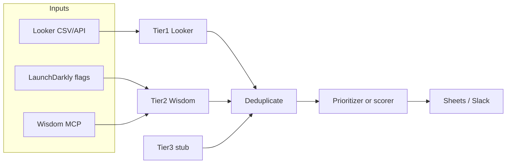

# figment-agent

Python pipeline that builds the **E100 expansion account list**: Tier 1 usage data from Looker, Tier 2 competitive intelligence from [Enterpret Wisdom](https://helpcenter.enterpret.com/en/articles/12665166-wisdom-mcp-server) (MCP), optional Tier 3 hooks, merge/dedupe, then either an **LLM prioritizer** (LaunchDarkly AI Config + Anthropic fallback) or **deterministic scoring**.

## What it does

1. **Tier 1 — Looker** — Loads accounts from a CSV export (`LOOKER_EXPORT_PATH`) or, when configured, from the Looker API.
2. **Tier 2 — Enterpret Wisdom** — If `WISDOM_AUTH_TOKEN` is set, runs one or more Wisdom MCP queries driven by LaunchDarkly **string** flags (or a YAML fallback).
3. **Tier 3** — Currently a stub; intended for future agentic / external collectors.
4. **Merge** — Deduplicates by account name and merges tier signals.
5. **Rank** — Either the **prioritizer** AI Config (see below) or `merge_and_score()` using weights in `config/settings.yaml`.
6. **Output** — Optional Google Sheets write and Slack digest.

LaunchDarkly evaluation uses context key **`e100-agent`** (see `LD_RUN_CONTEXT_KEY` in `run.py`).

## Requirements

- Python **3.9+**
- Dependencies: see `pyproject.toml` (LaunchDarkly SDK + AI SDK, `httpx`, `gspread`, etc.)

## Quick start

```bash
python3 -m venv .venv
source .venv/bin/activate   # Windows: .venv\Scripts\activate
pip install -e ".[dev]"
cp .env.example .env
# Edit .env — at minimum LOOKER_EXPORT_PATH and any optional integrations
python run.py
```

Run tests:

```bash
pytest
```

## Configuration

### Environment (`.env`)

Copy `.env.example` to `.env`. Important groups:

| Area | Variables |
|------|-----------|
| **LaunchDarkly** | `LD_SDK_KEY` — enables flags and AI Config evaluation. Without it, the app runs in local mode (YAML fallback for Wisdom prompts when applicable). |
| **Looker** | `LOOKER_EXPORT_PATH` — path to exported CSV (file mode). For API mode, see `agents/tier1_looker.py` and unset `LOOKER_EXPORT_PATH`. |
| **Wisdom MCP** | `WISDOM_AUTH_TOKEN` — [Bearer token from Enterpret](https://helpcenter.enterpret.com/en/articles/12665166-wisdom-mcp-server). Optional: `WISDOM_SERVER_URL`, `WISDOM_TIER2_PARALLEL`, `WISDOM_CYPHER_*`, `WISDOM_TIER2_TOOL`. |
| **Prioritizer** | `E100_PRIORITIZER_MODE=deterministic` — skips the LLM and ranks with `merge_and_score` / `core/scorer.py` (Tier 1 usage heuristics + Tier 2 urgency). Default `llm` tries the AI Config then falls back on failure. `ANTHROPIC_API_KEY` is only needed for the direct-API fallback when mode is `llm`. |
| **Outputs** | `GOOGLE_SHEET_ID`, `SLACK_WEBHOOK_URL` — optional. |

String flag keys for Tier 2 prompt bodies are listed in `.env.example` and defined in `agents/wisdom_prompts.py` (`WISDOM_PROMPT_FLAG_KEYS`). Cypher overrides map to env suffixes in `WISDOM_CYPHER_ENV_SUFFIX_BY_FLAG_KEY`.

### Application config (`config/settings.yaml`)

- **`scoring`** — Weights for deterministic `merge_and_score` (`core/scorer.py`).
- **`thresholds`**, **`schedule`**, **`output`** — Reference / future automation.
- **`wisdom.tier2_prompt_fallback`** — Used when `LD_SDK_KEY` is missing or all Wisdom string flags resolve to empty strings.

## Architecture



| Package / module | Role |
|------------------|------|
| `run.py` | Async orchestration entrypoint. |
| `agents/tier1_looker.py` | Looker export load + `AccountRecord` normalization (`EXPORT_COLUMN_MAP`). |
| `agents/tier2_enterpret.py` | Wisdom MCP session(s), prompt jobs, merge into accounts. |
| `agents/wisdom_mcp.py` | Streamable HTTP MCP client (`tools/call`, `initialize_wisdom` warmup). |
| `agents/wisdom_prompts.py` | Resolves prompt jobs from LD string flags or YAML. |
| `agents/prioritizer.py` | LaunchDarkly AI Config + Anthropic Messages fallback. |
| `core/schema.py` | `AccountRecord` datamodel. |
| `core/deduplicator.py`, `core/merger.py`, `core/scorer.py` | Merge and deterministic ranking. |
| `outputs/` | Google Sheets and Slack integrations. |

## LaunchDarkly

- **Wisdom prompts** — Multivariate **string** flags (not JSON). Bootstrap: `python bootstrap/create_wisdom_string_flags.py` (requires `LD_API_KEY` and project env vars). See `bootstrap/wisdom_prompt_flag_defaults.py` for default copy.
- **Prioritizer** — AI Config key defaults to `e100-prioritizer` (`E100_PRIORITIZER_AI_CONFIG_KEY`). Set **`E100_PRIORITIZER_MODE=deterministic`** to never call the LLM (heuristic ranking only). Create/update the AI Config via `python bootstrap/create_configs.py`. If mode is `llm` and the config is **disabled** in LD, the runner falls back to `merge_and_score`. For **offline evaluations**, see [docs/prioritizer-offline-eval.md](docs/prioritizer-offline-eval.md) and `docs/examples/prioritizer_eval.sample.jsonl`.

## Enterpret Wisdom notes

- The client calls **`initialize_wisdom`** once per MCP session (Enterpret’s recommendation).
- For **tabular** account rows, set **`WISDOM_CYPHER_*`** (or `WISDOM_CYPHER`) so Tier 2 uses **`execute_cypher_query`**. Relying on **`search_knowledge_graph`** alone often returns metadata or prose, not a list of account objects.
- Responses are normalized in `records_from_wisdom_tool_result` in `agents/wisdom_mcp.py`.

## Repository layout

```
agents/          # Tier agents, Wisdom MCP client, prioritizer, LD init
bootstrap/       # LD API helpers (AI Config, Wisdom string flags)
config/          # settings.yaml
core/            # schema, dedupe, merge, scoring
outputs/         # Sheets, Slack
tests/           # pytest
run.py           # CLI entrypoint
```

## Troubleshooting

| Symptom | Things to check |
|--------|------------------|
| **Tier 2 loads 0 accounts** | `WISDOM_AUTH_TOKEN` valid; **`ServiceError`** / empty `error` often indicates an Enterpret graph or search outage—contact support if it persists. **`search_knowledge_graph`** frequently returns only `org_id` + echoed `query` (no account list); use **`WISDOM_CYPHER_*`** / **`WISDOM_CYPHER`** so Tier 2 calls **`execute_cypher_query`**. Confirm Wisdom string flags are **on** and non-empty for `LD_SDK_KEY`. |
| **Prioritizer errors** | Set **`E100_PRIORITIZER_MODE=deterministic`** to skip the LLM entirely. If mode is `llm`, logs may show `ldai_langchain not found` — install optional LangChain provider packages if you use that path, or rely on direct Anthropic. HTTP **400** from Anthropic often means **billing/credits** or invalid model; or **disable** the prioritizer AI Config in LaunchDarkly to force **`merge_and_score`**. |
| **Looker load fails** | `LOOKER_EXPORT_PATH` exists; CSV headers still match `EXPORT_COLUMN_MAP` in `agents/tier1_looker.py`. |

## Security

- Never commit `.env` or service account JSON (see `.gitignore`).
- Wisdom and prioritizer data stay in **your** Enterpret and Anthropic/LD-configured providers; this codebase does not call OpenAI.

## License

No license file is present in this repository; treat usage as internal unless you add one.
