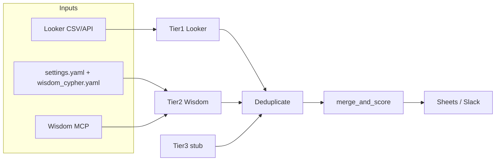

# figment-agent

Python pipeline that builds the **E100 expansion account list**: Tier 1 usage data from Looker, Tier 2 competitive intelligence from [Enterpret Wisdom](https://helpcenter.enterpret.com/en/articles/12665166-wisdom-mcp-server) (MCP), optional Tier 3 hooks, merge/dedupe, and **deterministic** ranking via `merge_and_score` / `core/scorer.py`.

## What it does

1. **Tier 1 — Looker** — Loads accounts from a CSV export (`LOOKER_EXPORT_PATH`) or, when configured, from the Looker API.
2. **Tier 2 — Enterpret Wisdom** — If `WISDOM_AUTH_TOKEN` is set, runs Wisdom MCP jobs using prompts from `config/settings.yaml` and embedded Cypher from `config/wisdom_cypher.yaml`.
3. **Tier 3** — Currently a stub; intended for future agentic / external collectors.
4. **Merge** — Deduplicates by account name and merges tier signals.
5. **Rank** — `merge_and_score()` using weights in `config/settings.yaml`.
6. **Output** — Optional Google Sheets write and Slack digest.

## Requirements

- Python **3.9+**
- Dependencies: see `pyproject.toml` (`httpx`, `gspread`, `pyyaml`, etc.)

## Quick start

```bash
python3 -m venv .venv
source .venv/bin/activate   # Windows: .venv\Scripts\activate
pip install -e ".[dev]"
cp .env.example .env
# Edit .env — at minimum LOOKER_EXPORT_PATH and any optional integrations
python run.py
```

Run tests:

```bash
pytest
```

## Configuration

### Environment (`.env`)

Copy `.env.example` to `.env`. Important groups:

| Area | Variables |
|------|-----------|
| **Looker** | `LOOKER_EXPORT_PATH` — path to exported CSV (file mode). For API mode, see `agents/tier1_looker.py` and unset `LOOKER_EXPORT_PATH`. |
| **Wisdom MCP** | `WISDOM_AUTH_TOKEN` — [Bearer token from Enterpret](https://helpcenter.enterpret.com/en/articles/12665166-wisdom-mcp-server). Optional: `WISDOM_SERVER_URL`, `WISDOM_TIER2_PARALLEL`, `WISDOM_CYPHER_*`, `WISDOM_TIER2_TOOL`. |
| **Outputs** | `GOOGLE_SHEET_ID`, `SLACK_WEBHOOK_URL` — optional. |

Tier 2 uses two stable **job keys** in `agents/wisdom_prompts.py` (`WISDOM_TIER2_JOB_KEYS`) for logging and Cypher env overrides (`WISDOM_CYPHER_<SUFFIX>` via `WISDOM_CYPHER_ENV_SUFFIX_BY_FLAG_KEY`). Each job runs Gong + Zendesk embedded Cypher from `wisdom_cypher.yaml`.

### Application config (`config/settings.yaml`)

- **`scoring`** — Weights for deterministic `merge_and_score` (`core/scorer.py`).
- **`thresholds`**, **`schedule`**, **`output`** — Reference / future automation.
- **`wisdom.tier2_prompt_fallback`** (or **`tier2_prompt_default`**) — Shared prompt text for both Tier-2 jobs (search fallback when Cypher is unset). Optional **`wisdom.tier2_prompts.<job_key>`** overrides per job.

## Architecture



| Package / module | Role |
|------------------|------|
| `run.py` | Async orchestration entrypoint. |
| `agents/tier1_looker.py` | Looker export load + `AccountRecord` normalization (`EXPORT_COLUMN_MAP`). |
| `agents/tier2_enterpret.py` | Wisdom MCP session(s), prompt jobs, merge into accounts. |
| `agents/wisdom_mcp.py` | Streamable HTTP MCP client (`tools/call`, `initialize_wisdom` warmup). |
| `agents/wisdom_prompts.py` | Resolves Tier-2 prompt jobs from `config/settings.yaml`. |
| `agents/prioritizer.py` | `apply_prioritizer_response` helper for tests / future hooks. |
| `core/schema.py` | `AccountRecord` datamodel. |
| `core/deduplicator.py`, `core/merger.py`, `core/scorer.py` | Merge and deterministic ranking. |
| `outputs/` | Google Sheets and Slack integrations. |

## Enterpret Wisdom notes

- **Graph schema (CLI):** `python bootstrap/wisdom_get_schema.py` — prints MCP `get_schema` as JSON (`WISDOM_AUTH_TOKEN` required). Use `--list-tools` to see tool names; `--no-warmup` skips `initialize_wisdom`.
- The client calls **`initialize_wisdom`** once per MCP session (Enterpret’s recommendation).
- For **tabular** account rows, Tier 2 uses **`execute_cypher_query`** when Cypher is set. **Precedence:** env `WISDOM_CYPHER_<SUFFIX>` (one string replaces the whole job) → embedded defaults in [`config/wisdom_cypher.yaml`](config/wisdom_cypher.yaml) → env `WISDOM_CYPHER`. Competitive displacement and switching intent each run **two** embedded queries (Gong, then Zendesk) per Tier-2 job; results merge by account. Set **`WISDOM_DISABLE_EMBEDDED_CYPHER=1`** to skip the YAML defaults (search-only unless env Cypher is set). Relying on **`search_knowledge_graph`** alone often returns metadata or prose, not account rows.
- Responses are normalized in `records_from_wisdom_tool_result` in `agents/wisdom_mcp.py`.

## Repository layout

```
agents/          # Tier agents, Wisdom MCP client
bootstrap/       # wisdom_get_schema helper
config/          # settings.yaml, wisdom_cypher.yaml (embedded Tier-2 Cypher)
core/            # schema, dedupe, merge, scoring
outputs/         # Sheets, Slack
tests/           # pytest
run.py           # CLI entrypoint
```

## Troubleshooting

| Symptom | Things to check |
|--------|------------------|
| **Tier 2 loads 0 accounts** | `WISDOM_AUTH_TOKEN` valid; **`ServiceError`** / empty `error` often indicates an Enterpret graph or search outage—contact support if it persists. Ensure Cypher runs: check **`config/wisdom_cypher.yaml`** (embedded) or env **`WISDOM_CYPHER_*`** / **`WISDOM_CYPHER`**. Confirm **`wisdom.tier2_prompt_fallback`** (or per-job **`tier2_prompts`**) is set in **`config/settings.yaml`**. |
| **Looker load fails** | `LOOKER_EXPORT_PATH` exists; CSV headers still match `EXPORT_COLUMN_MAP` in `agents/tier1_looker.py`. |

## Security

- Never commit `.env` or service account JSON (see `.gitignore`).
- Wisdom data uses **your** Enterpret tenant; this codebase does not call OpenAI or LaunchDarkly.

## License

No license file is present in this repository; treat usage as internal unless you add one.
