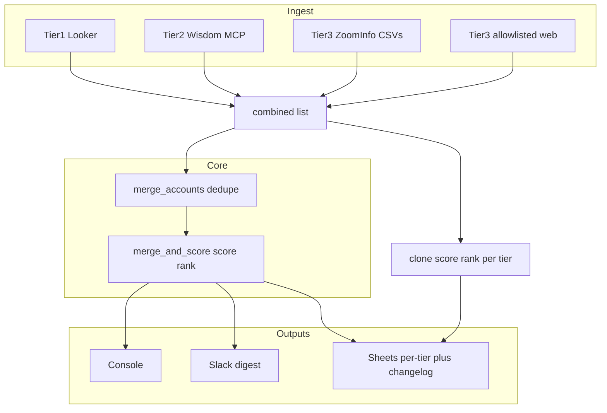

# Figment agent — architecture

This document describes how **figment-agent** is structured: data flow, major modules, and design choices. For setup and env vars, see the [README](../README.md).

## Purpose

**Figment (figment-agent)** is a Python **batch pipeline** that builds the **E100 expansion account list**. It pulls accounts from multiple sources (usage, competitive intel, optional third-party and web signals), **deduplicates by account name**, **scores and ranks** deterministically, then **emits** console output, optional **Google Sheets**, and optional **Slack**.

## Core data model

- [`core/schema.py`](../core/schema.py) defines **`AccountRecord`**: identity, commercial fields (ARR, plan, geo, …), tier (`1` / `2` / `3`), tier-specific signals, scoring outputs (`expansion_score`, `priority_rank`), and **`looker_extras` / `wisdom_extras` / `tier3_extras`** for wide CSV/Sheets columns.

Downstream code assumes this single type.

## Orchestration (control flow)

- [`run.py`](../run.py) is the **async entrypoint** (`asyncio.run(run_e100_refresh)`).
- It **sequentially** runs Tier 1 → Tier 2 (if `WISDOM_AUTH_TOKEN` is set) → Tier 3 (ZoomInfo CSVs when present, then optional allowlisted web), **appends** all rows into a **`combined`** list, then:
  - Builds **per-tier Sheet rows** (cloned accounts with tier-local score/rank — see [Core processing](#core-processing-core)).
  - Runs **`merge_and_score(combined)`**, then **`resolve_e100_summary_list`** (default **50/25/25** by merged `tier` + score backfill to 100) for **console, Slack, and the optional E100 Summary sheet**; tier tabs remain full per-tier lists.
- **Configuration** is split between **`.env`** (secrets, paths, feature flags) and **`config/settings.yaml`** (scoring weights, Wisdom prompt text, summary quotas, etc.). Sheet tab titles are fixed in **`outputs/sheets_writer.py`**.



## Tier agents (`agents/`)

| Module | Role |
|--------|------|
| [`tier1_looker.py`](../agents/tier1_looker.py) | Loads Tier 1 from Looker **CSV** (or API path); maps columns → `AccountRecord`. |
| [`tier2_enterpret.py`](../agents/tier2_enterpret.py) + [`wisdom_mcp.py`](../agents/wisdom_mcp.py) | Tier 2 via **Enterpret Wisdom MCP** (HTTP MCP client, `initialize_wisdom`, tool calls). |
| [`wisdom_prompts.py`](../agents/wisdom_prompts.py) | Resolves which Tier-2 jobs run and prompt/Cypher sources. |
| [`tier3_zoominfo.py`](../agents/tier3_zoominfo.py) | Tier 3 from **ZoomInfo-style exports** under `data/` when files exist. |
| [`tier3_web.py`](../agents/tier3_web.py) | Optional Tier 3 from **allowlisted URLs** ([`config/tier3_sources.yaml`](../config/tier3_sources.yaml)), env-gated. |
| [`base.py`](../agents/base.py) | Shared agent scaffolding where used. |

Tier 2 tabular data is biased toward **`execute_cypher_query`** with Cypher from env or [`config/wisdom_cypher.yaml`](../config/wisdom_cypher.yaml). [`bootstrap/wisdom_get_schema.py`](../bootstrap/wisdom_get_schema.py) is a CLI helper for graph schema.

## Core processing (`core/`)

- [`deduplicator.py`](../core/deduplicator.py) — **`merge_accounts`**: merge rows with the same normalized account name; Tier 1 preferred for base commercial fields; overlays and extras merge with documented precedence.
- [`scorer.py`](../core/scorer.py) — **`score`**: deterministic expansion score from **`config/settings.yaml`** weights and record fields.
- [`merger.py`](../core/merger.py) — **`merge_and_score`**: dedupe → score → global rank. **`select_e100_summary_list`** / **`resolve_e100_summary_list`**: tier quotas + backfill. Also **`clone_accounts_for_sheet_export`** + **`score_and_rank_for_export`** for **tier-local** scores/ranks on per-tier Sheets **without** mutating `combined`.

## Outputs (`outputs/`)

- [`sheets_writer.py`](../outputs/sheets_writer.py) — Writes **three tier tabs** (full lists), optional **E100 Summary** (quota list) when `E100_WRITE_MERGED_MASTER`, **changelog**, then **reorders** tabs so Summary is first. **Local JSON snapshot** for run-to-run diffs ([`sheets_run_diff.py`](../outputs/sheets_run_diff.py)).
- [`e100_manifest.py`](../outputs/e100_manifest.py) + [`config/e100_output_columns.yaml`](../config/e100_output_columns.yaml) — Column definitions for Sheets (fields + extras).
- [`slack_notifier.py`](../outputs/slack_notifier.py) — Top-N digest from the **merged** ranked list.

## Configuration layout

- **`config/settings.yaml`** — Scoring, thresholds, schedule hints, **`output.e100_summary`** quotas, Wisdom prompt fallback / per-job overrides. **Google Sheet tab titles** are constants in [`outputs/sheets_writer.py`](../outputs/sheets_writer.py) (`_WORKSHEET_TITLES`).
- **`config/wisdom_cypher.yaml`** — Embedded Cypher for Tier 2 (when not overridden by env).
- **`.env`** — Paths, `WISDOM_AUTH_TOKEN`, `GOOGLE_SHEET_ID`, Slack webhook, flags (`E100_WRITE_MERGED_MASTER`, `E100_SHEET_MARK_CHANGES`, etc.). See [`.env.example`](../.env.example).

## Tests and tooling

- **`tests/`** — pytest coverage for merge/score, Wisdom MCP parsing, Tier 3 web, Sheets export ranking, credentials path, run-to-run diff, etc.
- **`scripts/`** — e.g. CSV header dumping for Looker alignment.

## Design choices worth preserving

1. **Deterministic ranking** — Same inputs + same config → same order (no LLM in the scorer).
2. **Two parallel views of data** — **Per-tier** ranked clones for Sheets vs **one merged** list for console/Slack/optional master tab.
3. **Secrets and snapshots** — Service account JSON and `.env` are gitignored; Sheets run-to-run diff uses a **local JSON snapshot** (e.g. under `data/`), not Google Sheets version history.

## Related module index (from README)

| Package / module | Role |
|------------------|------|
| `run.py` | Async orchestration entrypoint. |
| `agents/tier1_looker.py` | Looker export load + `AccountRecord` normalization. |
| `agents/tier2_enterpret.py` | Wisdom MCP session(s), prompt jobs, merge into accounts. |
| `agents/wisdom_mcp.py` | Streamable HTTP MCP client. |
| `agents/wisdom_prompts.py` | Resolves Tier-2 prompt jobs from `config/settings.yaml`. |
| `agents/prioritizer.py` | `apply_prioritizer_response` helper for tests / future hooks. |
| `core/schema.py` | `AccountRecord` datamodel. |
| `core/deduplicator.py`, `core/merger.py`, `core/scorer.py` | Merge and deterministic ranking. |
| `outputs/` | Google Sheets and Slack integrations. |

## Repository layout

```
agents/          # Tier agents, Wisdom MCP client
bootstrap/       # wisdom_get_schema helper
config/          # settings.yaml, wisdom_cypher.yaml, tier3_sources.yaml, e100_output_columns.yaml
core/            # schema, dedupe, merge, scoring
docs/            # This document and other internal notes
outputs/         # Sheets, Slack, manifest, run diff
tests/           # pytest
run.py           # CLI entrypoint
```
